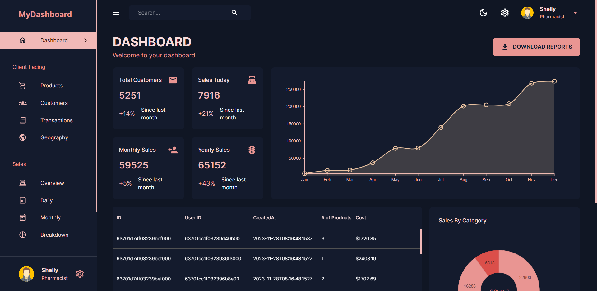

# MERN Dashboard Project

🚀 Device Monitoring Dashboard

A full-stack application to monitor device telemetry data, perform analysis, and display insights using a dashboard.

📌 Features

Device data simulation (100+ records)

Pagination & filtering

Aggregation APIs

Dashboard with charts

Uptime calculation

⚙️ Backend

Node.js + Express

REST APIs

In-memory database (mock data)

📡 API Documentation
Get Devices
GET /api/devices?page=1&limit=10&status=active
Get Summary
GET /api/devices/summary
🧠 Uptime Calculation
Uptime % = (Active Devices / Total Devices) × 100
🗄️ Schema
deviceId: String
temperature: Number
vibration: Number
status: active | fault
timestamp: Date
⚡ Data Generation

100 random device records generated on server start

Random:

temperature (20–100)

vibration (10–80)

status (active/fault)

⚙️ Setup
Backend
cd server
npm install
npm run dev
Frontend
cd client
npm install
npm run dev
🌐 Run

Frontend: http://localhost:5173

Backend: http://localhost:5000

## 🗄️ Database

- MongoDB Atlas (Cloud Database)
- Mongoose used for schema and queries

## ⚡ Data Generation

Run:
GET /api/seed

This generates 100+ random device records in MongoDB.

## 📡 Sample API Response

GET /api/devices/summary

{
  "avgTemp": 45.3,
  "maxVibration": 78,
  "totalFaults": 12,
  "uptimePercentage": 82.5
}

👨‍💻 Author

Aditya Goswami
